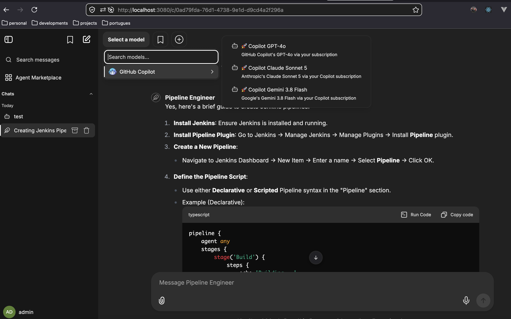
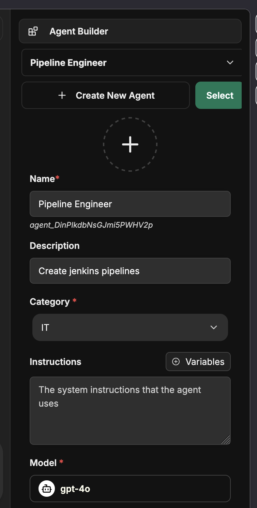
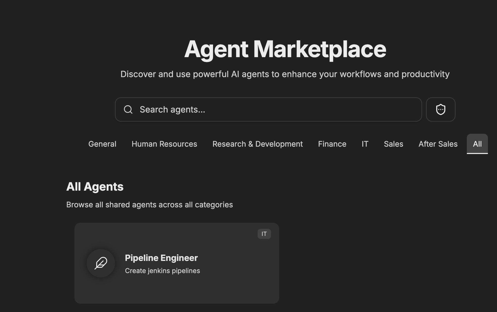
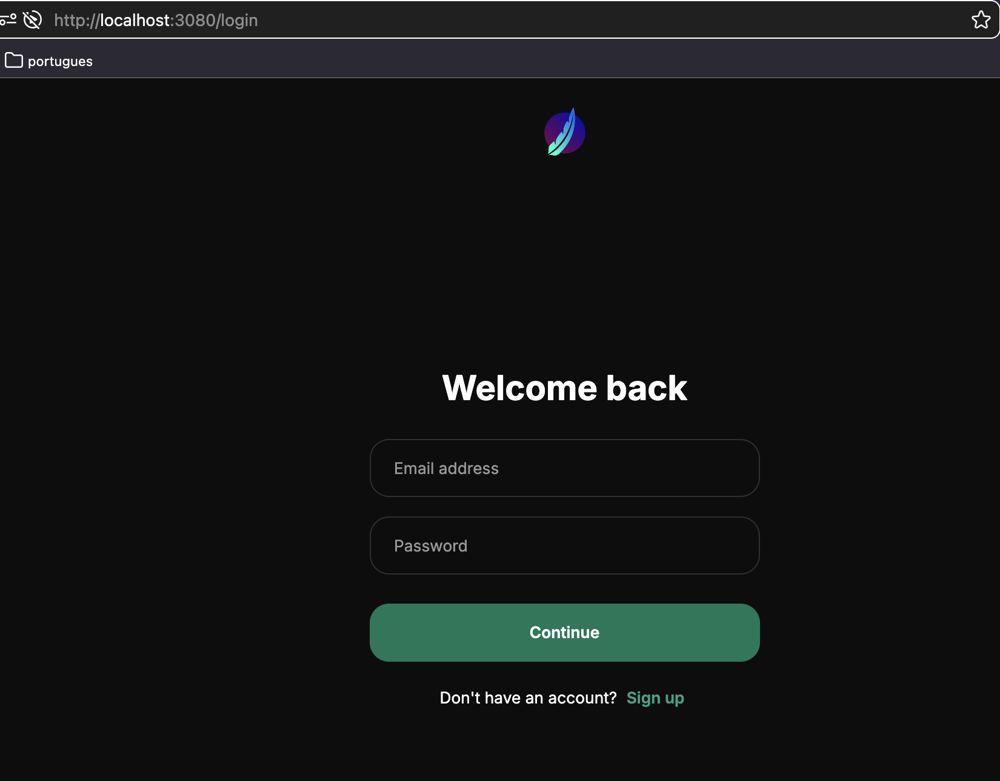

# AI Chat Platform — Demo Guide

> **Branch:** `feat/github-copilot-endpoint`
> **Base:** LibreChat (open-source, self-hosted multi-model chat platform)
> **Goal:** A proof-of-concept self-hosted AI chat platform that puts **shared agents**, **MCP tools/skills**, **RAG**, and **any model** (local, third-party, or the Copilot seat we already own) in one place — more open and customizable than IDE- or Office-native Copilot.

---

## 1. Context & Purpose

### Context

Microsoft 365 Copilot is great for individuals, but our plan holds it back:

- No **RAG** over our own content.
- No **shared agents** across teams.
- No **MCP** integrations.
- No **local or third-party models**.

It helps one person in one app — it isn't a platform the company can build on.

### Purpose

> From a tool for one person to a platform for the company.

A self-hosted AI chat platform teams can shape, share, and trust — open, customizable, and not boxed in by any plan or vendor.

- **Agents, shared company-wide** — define once, make available to every team.
- **Answers with sources** — RAG grounds agents in our own content.
- **Tools, not just talk** — MCP connects internal systems; code interpreter builds charts, docs, code.
- **Memory that compounds** — context carries forward, so it gets sharper over time.
- **Any model** — local, third-party, or the Copilot seat we already own. No lock-in.
- **Consumable by API** — other teams and tools can drive the same platform programmatically.
- **Ready for the enterprise** — SSO, roles, usage controls; data stays on our infra.

One open foundation where agents, knowledge, and models live together — and where our AI initiatives can grow.

### Architecture at a glance

```
┌────────────┐     ┌──────────────────────────┐     ┌──────────────────────────────┐
│  Browser / │───▶│  LibreChat API (3080)    │───▶│  github-copilot endpoint      │
│  Python    │    │  • agents  • MCP         │    │  api.individual.githubcopilot │
│  client    │    │  • RAG     • modelSpecs  │    │  .com  (existing Copilot seat)│
└────────────┘     └───────────┬──────────────┘     └──────────────────────────────┘
                               │
                  ┌────────────┴─────────────┐
                  │  MongoDB  ·  Redis  ·    │
                  │  Meilisearch             │
                  └──────────────────────────┘
```

### In the UI








---

## 2. Setup & Configuration

### Prerequisites

- Docker + Docker Compose
- An active **GitHub Copilot** subscription (for the Copilot endpoint)
- Python 3.9+ (for the helper/test scripts)
- Optional: Google Gemini and/or DeepSeek API keys

### Key `.env` settings

Copy the template and fill in the values:

```bash
cp .env.example .env
```

| Variable | Purpose | Example |
| --- | --- | --- |
| `COPILOT_TOKEN` | Long-lived GitHub OAuth token (from device flow) | `gho_...` |
| `COPILOT_BEARER` | Short-lived Copilot bearer, refreshed from the token | `<copilot-bearer-token>` |
| `GOOGLE_KEY` | Google Gemini API key (native endpoint) | `AIza...` |
| `DEEPSEEK_API_KEY` | DeepSeek API key (custom endpoint) | `sk-...` |
| `ENDPOINTS` | Which endpoint groups to expose | `agents,google,custom` |
| `GOOGLE_MODELS` | Gemini models to list | `models/gemini-2.5-flash,...` |
| `DEFAULT_MODEL` | Default model for new chats | `models/gemini-2.5` |
| `USE_REDIS` / `USE_REDIS_STREAMS` | Enable Redis caching & resumable streams | `true` |
| `REDIS_URI` | Redis connection (service name in Docker) | `redis://redis:6379` |
| `REDIS_KEY_PREFIX` | Namespace for all keys | `librechat` |
| `UID` / `GID` | Container user mapping (avoids file-permission issues) | `1000` |

> ⚠️ **`COPILOT_BEARER` expires (~24h).** `COPILOT_TOKEN` does not. Refresh the bearer with the script in section 3 before demoing.

### Endpoint configuration (`librechat.yaml`)

The branch ships `librechat.example.yaml` with four endpoint groups. Copy it into place:

```bash
cp librechat.example.yaml librechat.yaml
```

Highlights:

- **`agents`** — agent builder enabled, recursion limits, citations, capabilities (`execute_code`, `file_search`, `actions`, `tools`).
- **`google`** — native Gemini endpoint.
- **`custom` → `deepseek`** — DeepSeek chat/coder via `baseURL`.
- **`custom` → `github-copilot`** — the star of the demo:

```yaml
- name: "github-copilot"
  apiKey: ${COPILOT_BEARER}
  baseURL: "https://api.individual.githubcopilot.com"
  headers:
    User-Agent: "GitHubCopilotChat/0.26.7"
    Copilot-Integration-Id: "vscode-chat"
    Editor-Version: "vscode/1.95.0"
  models:
    fetch: false
    default:
      - gpt-4o
      - gpt-4o-mini
      - gpt-5.5
      - claude-sonnet-5
      - claude-opus-4.8
      - gemini-3.8-flash
      - grok-4.7
```

`modelSpecs` also defines ready-made presets (e.g. **🚀 Copilot GPT-4o**, **🚀 Copilot Claude Sonnet 5**, **🚀 Copilot Gemini 3.8 Flash**) that show up as one-click chips in the UI.

### Start the stack

```bash
docker compose up -d
```

Services: `api` (LibreChat, port `3080`), `mongodb`, `redis`, `meilisearch`.

> Note: RAG (vectordb / rag_api) is **commented out** in this compose file to keep the demo dependency-free. Uncomment those services to enable RAG.

Then open **http://localhost:3080**.

---

## 3. GitHub Copilot Token Flow

The Copilot API needs a **bearer** that LibreChat can't mint by itself. Two small scripts bridge that gap.

```
GitHub device login ──▶ COPILOT_TOKEN ──▶ exchange ──▶ COPILOT_BEARER (~24h) ──▶ LibreChat
      (one time)           (long-lived)                 (refresh daily)
```

### Step 1 — Get a COPILOT_TOKEN (one time)

```bash
cd test-clients
python3 get-copilot-token.py --verify
```

- Prints a URL (`github.com/login/device`) and a code.
- Approve access in the browser.
- The script prints the **OAuth token** → put it in `.env` as `COPILOT_TOKEN`.
- `--verify` confirms Copilot access and shows the API base URL.

### Step 2 — Refresh the bearer (daily / before demo)

```bash
python3 refresh-copilot-bearer.py --env-path ../.env
```

- Reads `COPILOT_TOKEN` from `.env`.
- Exchanges it for a fresh `COPILOT_BEARER`.
- Writes it back into `.env` and prints how long it's valid.

**Restart LibreChat** to pick up the new value:

```bash
docker compose restart api
```

> 💡 Run step 2 right before the demo — the bearer is only valid ~24h.

---

## 4. Demo / Verification

### Install the Python client deps

```bash
cd test-clients
pip install -r requirements.txt
```

(`requests`, `sseclient-py`, `ipdb`)

### What `client-python.py` does

A minimal reference client that talks to the LibreChat API:

- `GET /api/models` — list available models
- `GET /api/agents` — list agents
- `POST /api/agents` — create persona agents
- `POST /api/agents/chat` → SSE stream at `/api/agents/chat/stream/{streamId}` — **streaming chat**
- `GET /api/convos` — list conversations

> ⚠️ **Two gotchas:**
> 1. LibreChat's UA parser **blocks non-browser clients** — the client sets a browser `User-Agent` header. Keep it.
> 2. Paste a valid JWT into `TOKEN` (from the browser's dev tools → `Authorization` header).

### Run it

```bash
python3 client-python.py
```

Edit the `__main__` block to run the flow you want. Typical demo:

```python
# 1. list models & agents
list_models()
list_agents()

# 2. create / pick an agent, then stream a chat
result = send_message("Hello! Tell me a fun fact about AI.", agent_id=AGENT_ID)
get_responses(stream_id=result["streamId"], conversation_id=result["conversationId"])
```

You'll see the response stream token-by-token in the terminal — proof that the Copilot endpoint, agents, and SSE streaming all work end-to-end.

### Live demo script (suggested 5 min)



1. **Show the UI** — open `localhost:3080`, point out the model chips (🚀 Copilot GPT-4o, Claude Sonnet, Gemini).
2. **Chat with Copilot models** — send a prompt, switch model mid-conversation.
3. **Create a persona agent** — e.g. a "Code Reviewer" agent, align it with our AI initiatives.
4. **Stream via API** — run `client-python.py` to show programmatic access + streaming.
5. **Call out what's next** — MCP skills, RAG over internal docs, shared team agents.

### Redis message caching (branch addition)

Conversation history is cached per `conversationId:userId` and invalidated on save/update/delete:

- `api/models/Message.js` — `invalidateMessageCache()` on write/update/delete
- `api/server/routes/messages.js` — cache read on `GET /:conversationId`

Result: faster conversation loads, verified in the logs (`Getting messages from cache ...` vs `... from mongodb`).

---

## Troubleshooting

| Symptom | Fix |
| --- | --- |
| `Illegal request` from API | Send a browser `User-Agent` header (already set in `client-python.py`). |
| Copilot 401 / 403 | Refresh `COPILOT_BEARER` (section 3) and restart `api`. |
| Copilot exchange fails | Confirm an active Copilot subscription on the GitHub account. |
| Messages stale / not updating | Check Redis is up; cache invalidates automatically on writes. |
| Permission errors on files | Set `UID`/`GID` in `.env` to match the host user. |
